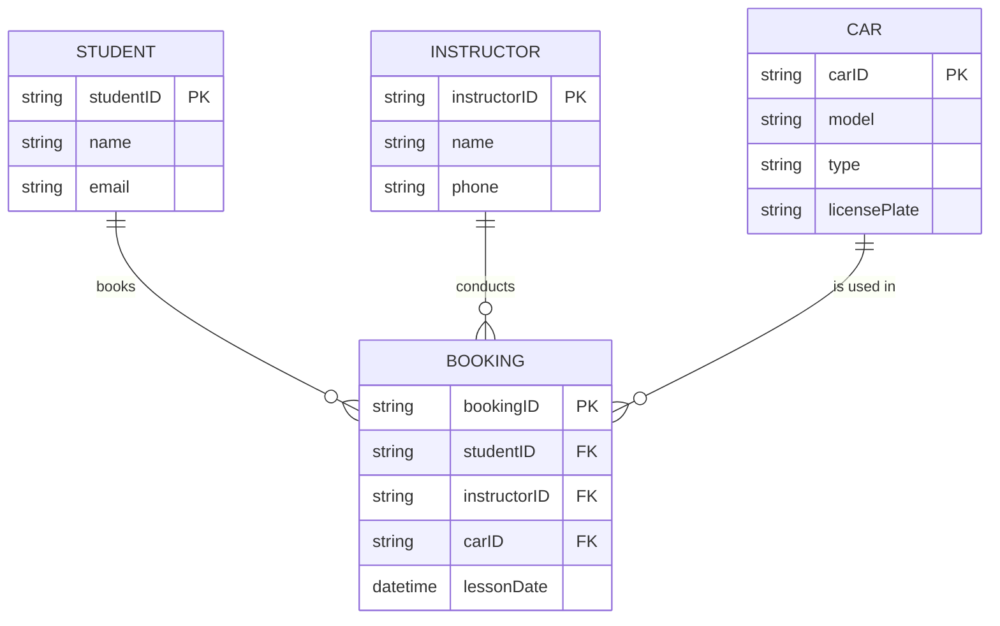
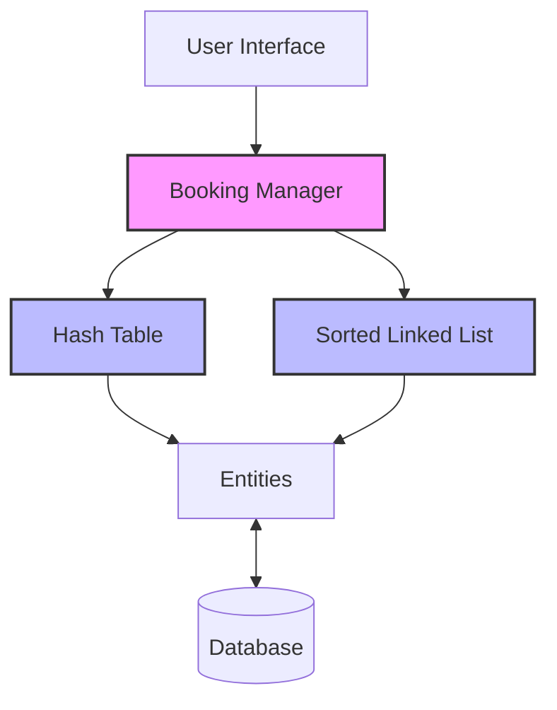
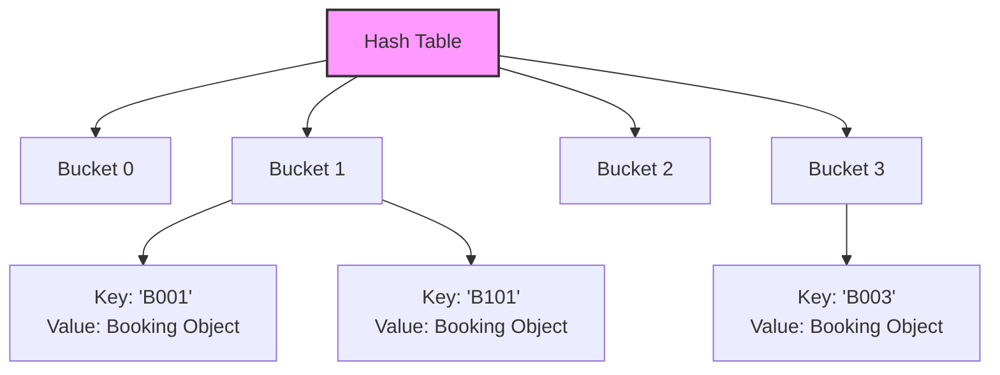
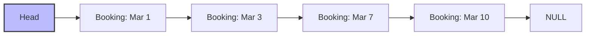
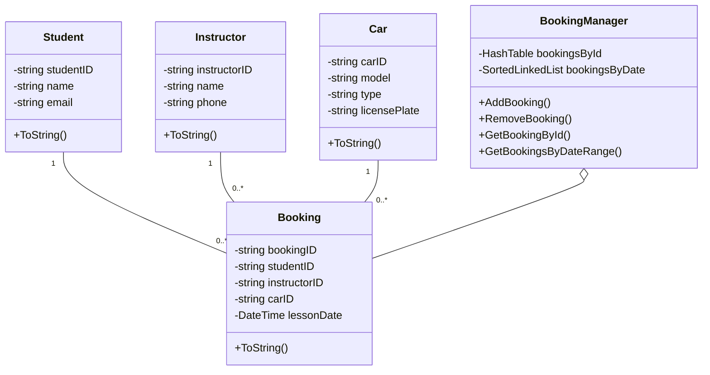
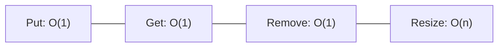
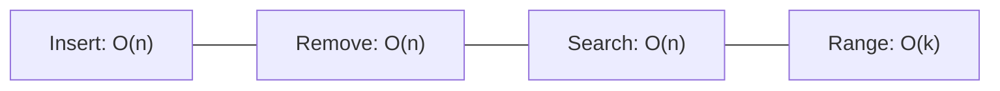
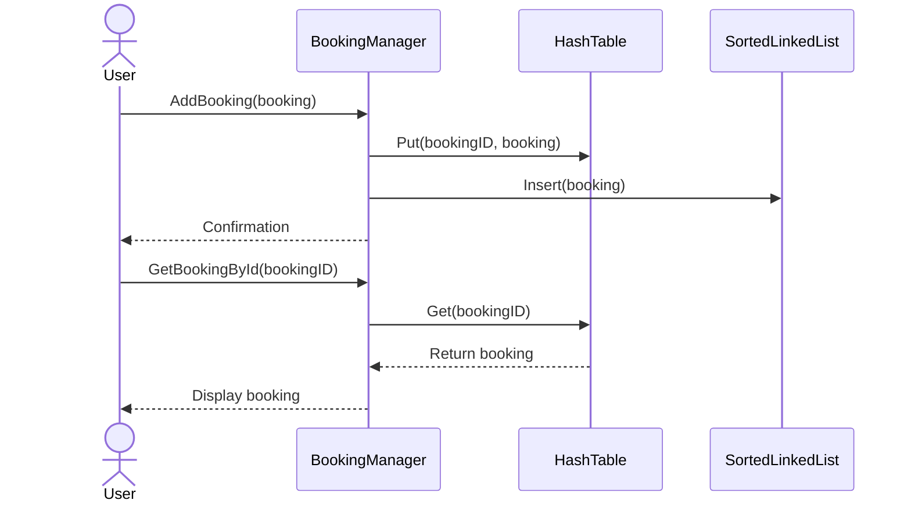
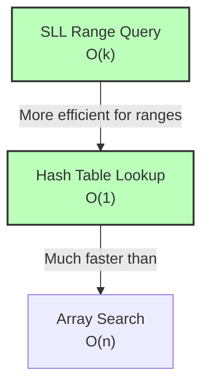

# Driving Lessons Booking System - Simplified Visual Documentation

## 1. Core Entities Relationship

## 2. Data Structure Overview

## 3. Hash Table Structure

## 4. Sorted Linked List Structure

## 5. Key Classes

## 6. Hash Table Operations

## 7. Sorted Linked List Operations

## 8. Booking Management Basic Flow

## 9. Hash Function Visualization

## 10. Performance Comparison

