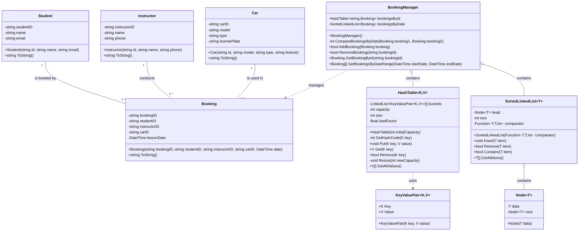

# Driving Lessons Booking System - Simplified Visual Documentation

## 1. Core Entities Relationship

## 2. Logical Model (System Components)

## 3. Physical Model (Class Diagram - Simplified)

## 4. Complete UML Class Diagram (Detailed)

## 5. Data Structure Performance Comparison

## 6. BookingManager Method Execution Flow

## 7. Hash Table Insertion and Collision Handling

## 8. Sorted Linked List Insertion Process

